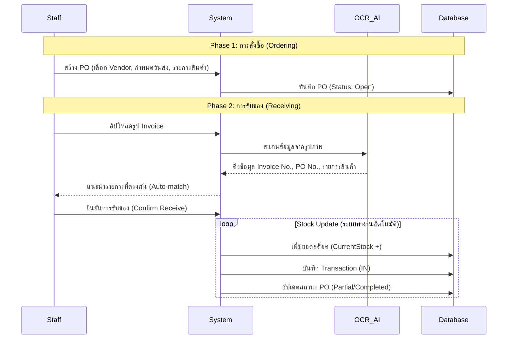

# IT Stock Pro - System Documentation (เอกสารระบบฉบับสมบูรณ์)

**System Version:** 2.0
**Last Updated:** 2026-02-11

---

## 1. Project Overview (ภาพรวมระบบ)
**IT Stock Pro** คือระบบบริหารจัดการคลังสินค้าสำหรับแผนก IT ที่ออกแบบมาเพื่อรองรับกระบวนการทำงานตั้งแต่ต้นจนจบ (End-to-End) ตั้งแต่การสั่งซื้อ (Procurement), การรับของเข้าคลัง (Receiving), การจัดเก็บ (Stocking), ไปจนถึงการเบิกจ่ายให้ผู้ใช้งาน (Withdrawal)

**ความสามารถหลักของระบบ:**
- **Real-time Tracking:** ตรวจสอบยอดคงเหลือ, มูลค่าสต็อค, และความเคลื่อนไหวสินค้าได้ทันที
- **Procurement Cycle:** จัดการใบสั่งซื้อ (PO), ติดตามสถานะการส่งมอบ (บางส่วน/ครบ), และบันทึก Invoice ด้วย **AI OCR**
- **Distribution:** ควบคุมการเบิกจ่ายพร้อมระบุเหตุผล (เช่น เบิกใหม่, เบิกทดแทน, หรือสำหรับโปรเจกต์)
- **Audit Trails:** บันทึก Log ทุกการเคลื่อนไหว (เข้า/ออก/แก้ไข) ตรวจสอบย้อนหลังได้ 100%
- **Access Control:** แบ่งสิทธิ์การใช้งานชัดเจนระหว่าง Admin (เจ้าหน้าที่) และ User ทั่วไป

---

## 2. System Architecture & Tech Stack (สถาปัตยกรรมและเทคโนโลยี)

ระบบถูกออกแบบด้วยสถาปัตยกรรมเว็บสมัยใหม่ (Modern Web Architecture) เพื่อความรวดเร็วในการใช้งาน

- **Frontend:** React, Vite, Tailwind CSS (UI), Lucide Icons, Recharts (กราฟ), Framer Motion (Animation)
- **Backend:** Node.js, Express REST API
- **Database:** สามารถรองรับ MSSQL หรือ SQLite (มีความยืดหยุ่นในการเชื่อมต่อ)
- **Authentication:** เชื่อมต่อกับระบบ Corporate AD (Active Directory) ขององค์กรเพื่อความปลอดภัยและการ Login ที่สะดวก (Single Sign-On)

### 2.1 Overall Application Flow (แผนผังการไหลของข้อมูล)

```mermaid
graph TD
    User([User / Staff]) --> Login{Login System (AD)}
    Login -- Valid Credentials --> CheckRole{Check Role}
    
    CheckRole -- Staff / Admin --> Dashboard_S[📊 Staff Dashboard]
    CheckRole -- User --> Dashboard_U[📊 User Dashboard (จำกัดสิทธิ์)]
    
    subgraph Staff_Modules [เมนูสำหรับเจ้าหน้าที่]
        Dashboard_S --> M_Inventory[📦 Inventory Mgmt (แก้ไข/เพิ่ม)]
        Dashboard_S --> M_PO[🛒 Purchase Orders (สั่งซื้อ)]
        Dashboard_S --> M_Receive[📥 Receive Items (รับของ + OCR)]
        Dashboard_S --> M_Users[🛡️ Admin Mgmt (จัดการสิทธิ์)]
        Dashboard_S --> M_Report[📈 Full Reports (รายงาน)]
        Dashboard_S --> M_Import[📥 Manual Import (นำเข้าพิเศษ)]
    end
    
    subgraph User_Modules [เมนูสำหรับผู้ใช้งานทั่วไป]
        Dashboard_U --> M_Withdraw[📤 Withdraw Items (เบิกของ)]
        Dashboard_U --> M_MyHistory[📜 Transaction History (ประวัติส่วนตัว)]
        Dashboard_U --> M_InvView[👀 Inventory (ดูรายการเท่านั้น)]
    end
```

---

## 3. User Roles & Access Control (สิทธิ์การใช้งาน)

| Role | Permissions (สิทธิ์) | Access Scope (ขอบเขต) |
|------|-----------------------|-----------------------|
| **Admin / Staff** | **Full Access** | สามารถดู, เพิ่ม, แก้ไข, ลบข้อมูลสินค้าได้ จัดการ Vendor, PO, รับของ และจัดการสิทธิ์ผู้ดูแลระบบ |
| **User** | **Restricted** | ดูรายการสินค้าได้ (Read-only), เบิกของ (Withdraw), ดูประวัติการเบิกของตนเอง (แก้ไข Master Data ไม่ได้) |

---

## 4. Database Schema (โครงสร้างฐานข้อมูล)

ระบบใช้ฐานข้อมูลเชิงสัมพันธ์ (Relational Database) เพื่อความถูกต้องของข้อมูล

### 4.1 Master Data Tables (ตารางข้อมูลหลัก)
| Table Name | Description | Key Columns |
|------------|-------------|-------------|
| **`Stock_Products`** | ข้อมูลสินค้า/อุปกรณ์ | `ProductID`, `ProductName`, `DeviceType` (ประเภท), `CurrentStock`, `MinStock`, `LastPrice` |
| **`Stock_DeviceTypes`** | ประเภทอุปกรณ์ (หมวดหมู่) | `TypeId`, `Label` (เช่น Asset, Monitor, Consumable) |
| **`Stock_Vendors`** | รายชื่อผู้ขาย (Supplier) | `VendorID`, `VendorName`, `ContactInfo`, `IsActive` |
| **`Stock_UserRole`** | ผู้ดูแลระบบ (Admin List) | `Username` (AD Login), `CreatedBy` |

### 4.2 Transaction & Procurement Tables (ตารางการทำรายการ)
| Table Name | Description | Key Columns |
|------------|-------------|-------------|
| **`Stock_PurchaseOrders`** | หัวบิลใบสั่งซื้อ (PO) | `PO_ID`, `VendorName`, `Status` (Open/Partial/Completed), `BudgetNo`, `Section` |
| **`Stock_PODetails`** | รายการย่อยใน PO | `DetailID`, `PO_ID`, `ItemName`, `QtyOrdered`, `QtyReceived` |
| **`Stock_Invoices`** | ประวัติการรับของ (Invoices) | `InvoiceID`, `InvoiceNo`, `PO_ID`, `ReceiveDate` |
| **`Stock_Transactions`** | Log การเคลื่อนไหวทั้งหมด | `TransID`, `TransType` (IN/OUT), `ProductID`, `Qty`, `RefInfo`, `UserID`, `TransDate` |

---

## 5. Key Workflows (ขั้นตอนการทำงานหลัก)

### 5.1 Procurement Process (จัดซื้อและรับของ)
ตั้งแต่เริ่มเปิด PO จนถึงนำของเข้าชั้นวาง



### 5.2 Withdrawal Process (การเบิกจ่าย)
ขั้นตอนการเบิกของไปใช้งาน

```mermaid
flowchart LR
    Start([User]) --> Scan[สแกน Barcode / ค้นหา]
    Scan --> Cart{หยิบใส่ตะกร้า}
    
    Cart --> Checkout[ไปที่ตะกร้าสินค้า]
    Checkout --> Reason{เลือกเหตุผลการเบิก}
    
    Reason -- New Issue --> Details[ระบุผู้ใช้ / แผนก]
    Reason -- Replacement --> Details
    Reason -- Project --> Details
    
    Details --> Confirm[ยืนยันการเบิก]
    Confirm --> DB[(Database)]
    
    subgraph System Actions (ระบบทำงานอัตโนมัติ)
        DB --> Cut[ตัดสต็อค]
        DB --> Log[บันทึก Transaction (OUT)]
        DB --> Alert[ตรวจสอบ Min Stock?]
    end
    
    Alert -- Yes --> Notify[แจ้งเตือนของใกล้หมด]
```

---

## 6. Page-by-Page Manual (คู่มือการใช้งานรายหน้า)

### 6.1 Dashboard (`DashboardPage.jsx`)
**"ศูนย์บัญชาการ" (The Command Center)**
- **Stats Cards:** ดูภาพรวมทันที - มูลค่าสต็อค, PO ที่ค้างรับ, สินค้าที่ต้องเติม
- **Visual Analytics:**
    - *Stock Movement Chart:* กราฟเปรียบเทียบ ยอดรับเข้า (IN) vs ยอดเบิกออก (OUT) ย้อนหลัง 6 เดือน
    - *Category Distribution:* แผนภูมิวงกลมแสดงสัดส่วนสินค้าตามประเภท
- **Operational Feeds:**
    - *Critical Low Stock:* รายการสินค้าที่ต่ำกว่าเกณฑ์ Min Stock (ต้องสั่งเพิ่ม)
    - *Pending POs:* รายการ PO ที่ยังส่งของไม่ครบ
    - *Recent Activity:* การเคลื่อนไหวล่าสุด 5 รายการแรก

### 6.2 Inventory Management (`InventoryPage.jsx`)
**"คลังข้อมูลสินค้า"**
- **Dual Views (มุมมอง):**
    - *Grid View:* แสดงเป็นการ์ดพร้อมรูปภาพ (เหมาะสำหรับดูของจริง)
    - *List View:* ตารางข้อมูลละเอียด (เหมาะสำหรับเช็คราคาและจำนวน)
- **Actions (การจัดการ):**
    - **Edit:** แก้ไขรายละเอียด, ราคา, หรือรูปภาพ
    - **History:** ดูประวัติเฉพาะสินค้านั้นๆ (ใครเบิกไปบ้าง? เข้ามาเมื่อไหร่?)
    - **Barcode:** พิมพ์บาร์โค้ดสำหรับติดที่ตัวสินค้าเพื่อสแกน

### 6.3 Purchase Orders (`PurchaseOrdersPage.jsx`)
**"ระบบสั่งซื้อ"**
- จัดการการสั่งซื้อกับ Vendor
- **Status Tracking:** ป้ายสถานะสีชัดเจน
    - `Open` (เปิดบิลใหม่)
    - `Partial` (รับแล้วบางส่วน)
    - `Completed` (รับครบแล้ว)
- **Detail View:** ดูรายละเอียดว่าสั่งอะไรไปบ้าง และรับของมาแล้วเท่าไหร่

### 6.4 Receive Items (`ReceivePage.jsx`)
**"จุดรับสินค้า"**
- **OCR Integration:** ใช้ AI อ่านบิลจากรูปถ่าย (ลดการพิมพ์เอง)
- **Matching Logic:** ระบบช่วยจับคู่รายการในบิลกับรายการใน PO ให้
- **Partial Receive:** รองรับการส่งของไม่ครบ (Backorder) ระบบจะรอยอดที่เหลือให้

### 6.5 Withdraw Items (`WithdrawPage.jsx`)
**"จุดบริการเบิกจ่าย"**
- **Shopping Cart:** เลือกเบิกได้หลายรายการพร้อมกันเหมือนช้อปปิ้ง
- **Scanner Ready:** ช่องค้นหารองรับเครื่องสแกนบาร์โค้ด ยิงปุ๊บของลงตะกร้าปั๊บ
- **Reason Codes:** ต้องระบุเหตุผลทุกครั้งเพื่อการตรวจสอบ (เช่น เบิกใหม่, เบิกทดแทน)

### 6.6 Transaction History (`HistoryPage.jsx`)
**"ประวัติการใช้งาน"**
- **Audit Trail:** ทุกการ +1 หรือ -1 จะถูกบันทึกที่นี่ ไม่มีตกหล่น
- **Searchable:** ค้นหาได้ละเอียด "ใครเอาสาย HDMI ไปเมื่อวันอังคาร?"
- **Mobile Optimized:** เปลี่ยนจากตารางเป็นการ์ดอัตโนมัติเมื่อดูผ่านมือถือ

### 6.7 Admin Management (`AdminUsersPage.jsx`)
**"จัดการผู้ดูแลระบบ"**
- เพิ่ม/ลดสิทธิ์เจ้าหน้าที่ (Admin/Staff) โดยใช้ Username จาก AD ของบริษัท

---

## 7. Detailed Function Flows (ขั้นตอนการทำงานละเอียด)

ในส่วนนี้จะอธิบายขั้นตอนการทำรายการ (Step-by-Step) สำหรับทุกฟังก์ชันในระบบ

### 🛍️ Inventory (จัดการสินค้า)
**1. การเพิ่มสินค้าใหม่ (Add Product)**
1.  ไปที่หน้า `Inventory`
2.  กดปุ่ม **"+ Add Product"** (มุมขวาบน)
3.  กรอกข้อมูล: ชื่อสินค้า, ประเภท (Device Type), Min Stock, ราคาล่าสุด
4.  (Optional) อัปโหลดรูปภาพสินค้า
5.  กด **"บันทึก"** -> สินค้าจะถูกสร้างใหม่โดยมียอด Stock เริ่มต้น = 0

**2. การแก้ไขสินค้า (Edit Product)**
1.  คลิกที่การ์ดสินค้า หรือปุ่ม Edit ใน List View
2.  แก้ไขข้อมูลที่ต้องการ (เช่น เปลี่ยนราคา, อัปเดต Min Stock)
3.  กด **"บันทึกการแก้ไข"**

**3. การพิมพ์บาร์โค้ด (Print Barcode)**
1.  คลิกปุ่ม **"QR/Barcode"** ที่รูปสินค้า
2.  หน้าต่าง Preview จะแสดงขึ้นมา
3.  สั่งพิมพ์ผ่าน Browser (Ctrl+P) เพื่อแปะที่ตัวสินค้า

**4. การลบสินค้า (Delete)**
1.  คลิกปุ่ม **"ลบ"** (ถังขยะ)
2.  ยืนยันการลบ
3.  *หมายเหตุ:* ลบได้เฉพาะสินค้าที่ไม่เคยมีการเคลื่อนไหว (Transaction) เท่านั้น หากเคยมีการเคลื่อนไหวแล้ว ระบบจะแจ้งเตือนให้ใช้การปรับสถานะเป็น Inactive แทน (เพื่อรักษาประวัติ)

---

### 🛒 Purchase Orders (การสั่งซื้อ)
**1. การสร้างใบสั่งซื้อ (Create PO)**
1.  ไปที่หน้า `Purchase Orders`
2.  กดปุ่ม **"+ Create PO"**
3.  กรอก: Vendor (ผู้ขาย), วันที่ส่งของ (Due Date), เลขที่ใบขอซื้อ (PR No.), งบประมาณ (Budget No.)
4.  เพิ่มรายการสินค้า: พิมพ์ชื่อ หรือเลือกจากสินค้าที่มีอยู่ -> ระบุจำนวน -> ระบุราคาต่อหน่วย
5.  กด **"Create Purchase Order"** -> สถานะจะเป็น `Open`

**2. การยกเลิก PO (Cancel Order)**
1.  คลิกดูรายละเอียด PO ที่ต้องการ
2.  หากสถานะยังเป็น `Open` สามารถกด **"Cancel PO"** ได้
3.  *หมายเหตุ:* หากมีการรับของไปบางส่วนแล้ว (`Partial`) จะไม่สามารถยกเลิกทั้งใบได้

---

### 📥 Receive Items (การรับของ)
**1. การรับของด้วย OCR (แนะนำ)**
1.  ไปที่หน้า `Receive Items`
2.  เลือก PO ที่ต้องการรับของ
3.  กดปุ่ม **"Upload Invoice Image"** -> เลือกรูปถ่ายใบส่งของ/ใบกำกับภาษี
4.  รอ AI ประมวลผลสักครู่
5.  ตรวจสอบความถูกต้อง: เลขที่ Invoice, รายการสินค้า
6.  กด **"Confirm Receive"** -> สต็อคสินค้าจะเพิ่มขึ้นทันที

**2. การรับของแบบ Manual (เมื่อไม่มีรูป)**
1.  ไปที่หน้า `Receive Items`
2.  เลือก PO ที่ต้องการ
3.  กรอกเลขที่ Invoice และวันที่รับของด้วยตนเอง
4.  ติ๊กเลือกรายการสินค้าที่ได้รับ และระบุจำนวนที่รับจริง (กรณีรับไม่ครบ)
5.  กด **"Confirm Receive"**

---

### 📤 Withdraw (การเบิกจ่าย)
**1. การเบิกสินค้า (Withdraw Process)**
1.  ไปที่หน้า `Withdraw`
2.  **ค้นหาสินค้า:** ยิง Barcode หรือพิมพ์ชื่อสินค้าในช่องค้นหา
3.  **ใส่ตะกร้า:** กด Enter หรือคลิกที่สินค้าเพื่อเพิ่มลง Cart
4.  ตรวจสอบรายการในตะกร้า (ด้านขวา) -> ปรับจำนวนที่ต้องการ
5.  กดปุ่ม **"Proceed to Checkout"**
6.  กรอกข้อมูลผู้เบิก:
    - **Requester Name:** ชื่อผู้เบิก
    - **Section:** แผนก
    - **Reason:** เหตุผล (New Withdrawal, Replacement, etc.)
7.  กด **"Confirm Withdraw"** -> สต็อคจะถูกตัดทันที

---

### 👥 Admin Management (จัดการผู้ใช้)
**1. การแต่งตั้ง Admin (Add Admin)**
1.  ไปที่หน้า `Admin Users`
2.  กดปุ่ม **"+ เพิ่ม Admin"**
3.  กรอก **AD Username** ของพนักงาน (เช่น `somchai.j`)
4.  กด **"เพิ่ม Admin"** -> พนักงานคนนั้นจะสามารถเข้าถึงเมนูผู้บริหารได้ทันที

**2. การถอนสิทธิ์ Admin (Remove Admin)**
1.  ในรายชื่อ Admin Users กดปุ่ม **"ถังขยะ"** หลังชื่อที่ต้องการ
2.  ยืนยันการลบ -> พนักงานคนนั้นจะกลับไปเป็น User ทั่วไป (ดูได้อย่างเดียว)

---

### 📈 Reports (รายงาน)
**1. การดูรายงาน (View Dashboard)**
1.  ไปที่เมนู `Report & Analytics`
2.  ดูสถิติ: ยอดเงินจม (Dead Stock), สินค้าหมุนเวียนเร็ว, แผนกที่เบิกเยอะที่สุด

**2. การส่งออกไฟล์ (Export Excel)**
1.  ในหน้า Report เลื่อนลงมาส่วนล่างสุด
2.  เลือกประเภทข้อมูล: Products, Transactions, Invoices, หรือ POs (เลือกได้หลายข้อ)
3.  (Optional) ระบุช่วงวันที่ (Start Date - End Date)
4.  กดปุ่ม **"Export to Excel"**
5.  ระบบจะสร้างไฟล์ .xlsx ให้ดาวน์โหลด
