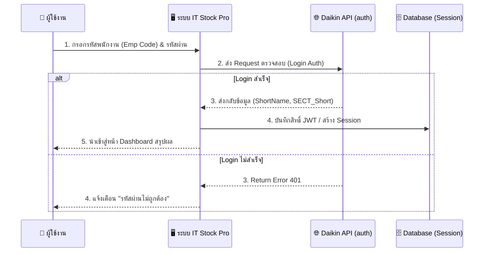
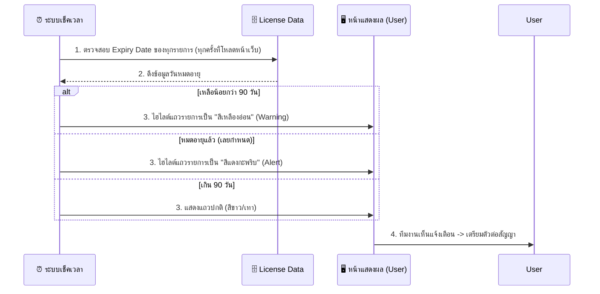

# แผนภาพขั้นตอนการทำงาน (User Flow) - IT Stock Pro

เอกสารนี้รวบรวม **User Flow** หลักๆ ของระบบ IT Stock Pro เพื่อให้เห็นภาพการไหลของข้อมูลและการปฏิบัติงาน (Data & Process Flow) อย่างชัดเจนตั้งแต่ต้นจนจบระบบครับ 

---

## 1. Flow การเข้าสู่ระบบ (Authentication Flow)
กระบวนการยืนยันตัวตนพนักงานผ่านฐานข้อมูล Daikin



---

## 2. Flow การเบิกจ่ายอุปกรณ์ (Outbound / Withdraw Flow)
ขั้นตอนเมื่อมีพนักงานหรือช่าง IT ต้องการเบิกของออกจากคลัง

```mermaid
flowchart TD
    A([เริ่ม: ผู้ใช้เข้าหน้า Inventory]) --> B[🔍 ค้นหาอุปกรณ์ (พิมพ์ชื่อ/ยิงบาร์โค้ด)]
    B --> C{อุปกรณเจอหรือไม่?}
    C -->|ไม่เจอ| D[❌ แจ้งเตือนไม่พบสินค้า]
    C -->|เจอ| E[🛒 กด 'เบิกของ' หรือ 'เพิ่มลงตะกร้า']
    
    E --> F[📝 กรอกจำนวนที่ต้องการเบิก]
    F --> G[📌 เลือกเหตุผลการเบิก (Reason)]
    G --> H[ระบุหมายเหตุเพิ่มเติม (ถ้ามี)]
    
    H --> I{กดยืนยันเบิก (Withdraw)}
    
    I -->|สำเร็จ| J[(ลบ CurrentStock ในระบบ)]
    I -->|สต็อกไม่พอ| P[❌ แจ้งเตือนสต็อกไม่เพียงพอ]
    
    J --> K[(บันทึก History Log)]
    K --> L([เสร็จสิ้น: แสดงยอดปัจจุบันอัปเดตทันที])
```

---

## 3. Flow การสั่งซื้อและรับเข้า (Inbound: PO & Receive Flow)
กระบวนการตั้งแต่ของเหลือน้อย จนสั่งซื้อ และรับเข้าตึก

```mermaid
flowchart TD
    subgraph 1. ฝั่งการสั่งซื้อ (PURCHASING)
        A([ระบบแจ้งเตือน Min Stock]) --> B[เปิดหน้า Purchase Orders]
        B --> C{มีใบ PO จากระบบหลักหรือยัง?}
        C -->|ยังไม่มี| D[คลิก 'เปิดใบขอซื้อ (PR)']
        D --> E[เลือกสินค้าเข้าฟอร์ม ดึงข้อมูลพนักงานออโต้]
        E --> F[🖨️ พิมพ์ใบ PR A5 ส่งฝ่ายจัดซื้อ]
        
        C -->|มีใบ PO แล้ว| G[อัปโหลดไฟล์ PDF (ใบสั่งซื้อ)]
        G --> H[🤖 ระบบ OCR สแกนดึงชื่อผู้ขาย & รายการของ]
        H --> I[ตรวจสอบ/แก้ไขข้อมูล]
        I --> J[(บันทึกเป็น Open PO)]
    end

    subgraph 2. ฝั่งการโอนรับเข้า (RECEIVING)
        K([ของมาส่งที่ตึก]) --> L[เปิดหน้า Receive (รับเข้า)]
        L --> M[เลือก PO ที่สั่งไว้ (ค้นหาจากเลข)]
        M --> N[กรอกเลข Invoice / DO]
        N --> O[ระบุจำนวนที่รับจริง (Receive Qty)]
        O --> P[(บวก CurrentStock เข้าคลัง)]
        P --> Q[(อัปเดตสถานะ PO: Completed หรือ Partial)]
        Q --> R[(บันทึก History Log)]
    end
```

---

## 4. Flow การตรวจนับสต็อกประจำเดือน (Stock Count / Audit Flow)
การตรวจสอบสต็อกคงเหลือจริงหน้างานเทียบกับในระบบ

```mermaid
flowchart TD
    SC1([สร้างรอบการนับใหม่ (New Session)]) --> SC2[ระบบสร้างรหัส Session (เช่น SC-202403-001)]
    SC2 --> SC3[เดินถือ Laptop/มือถือ ไปหน้าตู้]
    
    SC3 --> SC4[🔍 สแกนบาร์โค้ด หรือพิมพ์ชื่ออุปกรณ์]
    SC4 --> SC5[🔢 ใส่ตัวเลข > "ยอดที่นับได้จริง (Actual)"]
    SC5 --> SC6{นับครบทุกรายการหรือยัง?}
    
    SC6 -->|ยังไม่ครบ| SC4
    SC6 -->|นับครบแล้ว| SC7[คลิก 'ตรวจสอบ & ยืนยันผล' (Confirm)]
    
    SC7 --> SC8[(ระบบอัปเดต CurrentStock ใหม่ทั้งหมดให้ตรงแบบ Actual)]
    SC8 --> SC9[(บันทึกส่วนต่าง +/- เข้าประวัติ History)]
    SC9 --> SC10([เสร็จสิ้นรอบการตรวจนับ])
```

---

## 5. Flow การแจ้งเตือน License (Software / MA Tracking)
ระบบเฝ้าระวังโปรแกรมหรือสัญญาเข้าข่ายหมดอายุ



---

ผมหวังว่าแผนภาพเหล่านี้จะช่วยให้ทีมงานหรือผู้ที่มารับช่วงต่อมองเห็นภาพรวมของระบบ Data Flow ทั้งหมดได้อย่างชัดเจนที่สุดครับ หากต้องการรูปภาพ Flow ไหนเพิ่มเติม หรืออยากแก้ตรงไหนบอกได้เลยครับ 🚀
