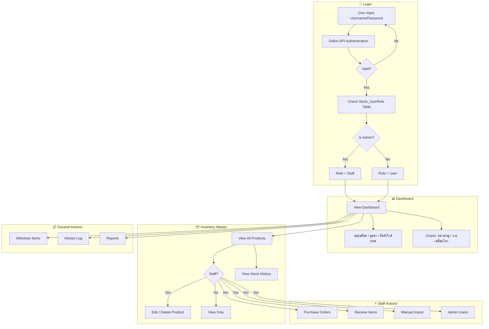
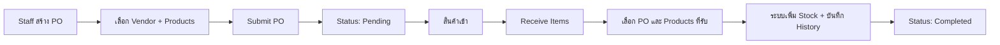

# IT Stock Pro - Workflow Documentation

## ภาพรวมระบบ

IT Stock Pro เป็นระบบจัดการสินค้าคงคลังสำหรับอุปกรณ์ IT ที่มีความสามารถครบวงจร

---

## User Roles

| Role | สิทธิ์การใช้งาน |
|------|----------------|
| **Staff** | จัดการสต็อคทั้งหมด, สร้าง PO, รับสินค้า, Manual Import, จัดการ Admin |
| **User** | ดู Inventory, เบิกสินค้า, ดู History, ดู Report |

---

## Application Workflow

---

## Purchase Order Flow

---

## Withdraw Flow

---

## ฟีเจอร์หลักของแต่ละหน้า

### 📊 Dashboard
- แสดงสรุปข้อมูลสต็อค (Total Stock, มูลค่า, สินค้าใกล้หมด)
- กราฟ Pie Chart แบ่งตามหมวดหมู่
- กราฟ Bar Chart แสดงการเคลื่อนไหว (IN/OUT) รายเดือน

### 📦 Inventory Master
- ดูรายการสินค้าทั้งหมด (Grid/List view)
- ค้นหา + Filter ตามประเภท
- **Staff**: แก้ไข, ลบสินค้า, ดู History

### 🛒 Purchase Orders (Staff)
- สร้างใบสั่งซื้อ (PO) ใหม่
- ดูรายการ PO ทั้งหมด
- ดูสถานะ (Pending/Completed)

### 📥 Receive Items (Staff)
- เลือก PO ที่ต้องการรับสินค้า
- เลือกรายการสินค้าและจำนวนที่ได้รับ
- ระบบเพิ่ม Stock + บันทึก History เป็น IN

### ➕ Manual Import (Staff)
- เพิ่มสินค้าใหม่โดยไม่ต้องอ้างอิง PO
- ใช้กรณีสินค้าที่มีอยู่แล้วหรือได้รับเป็นของแจก

### 📤 Withdraw Items
- เบิกสินค้าออกจากคลัง
- ระบบลด Stock + บันทึก History เป็น OUT

### 📜 History Log
- ดูประวัติการเคลื่อนไหวสินค้าทั้งหมด
- Filter ตามประเภท (IN/OUT)

### 📈 Reports
- สร้างรายงานสินค้าคงคลัง
- Export เป็น Excel

### 🛡️ Admin Users (Staff)
- จัดการรายชื่อ Admin (เพิ่ม/ลบ)
- ผู้ที่อยู่ในรายการจะได้ Role = Staff

---

## Database Tables

| Table | Description |
|-------|-------------|
| `Stock_Products` | รายการสินค้าทั้งหมด |
| `Stock_DeviceTypes` | ประเภทอุปกรณ์ |
| `Stock_PurchaseOrders` | ใบสั่งซื้อ (PO) |
| `Stock_PurchaseOrderItems` | รายการสินค้าใน PO |
| `Stock_Transactions` | ประวัติการเคลื่อนไหว (IN/OUT) |
| `Stock_UserRole` | รายชื่อ Admin Users |
