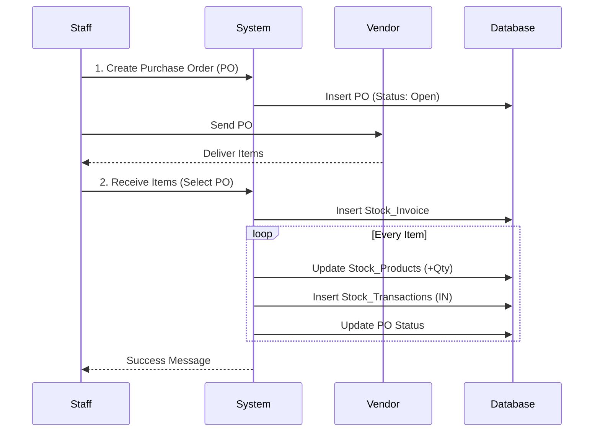

# IT Stock Pro - System Documentation & Workflow Report

## 1. Project Overview (ภาพรวมระบบ)
**IT Stock Pro** คือเว็บแอปพลิเคชันสำหรับจัดการคลังสินค้าอุปกรณ์ไอที (IT Asset & Inventory Management) แบบครบวงจร ช่วยให้ฝ่าย IT สามารถควบคุมสต็อค, จัดซื้อ (PO), รับของ (Receive), และจ่ายของ (Withdraw) ได้อย่างเป็นระบบ พร้อมฟีเจอร์รายงาน (Reporting) เพื่อวิเคราะห์ค่าใช้จ่ายและการใช้งาน

---

## 2. User Roles & Access Control (สิทธิ์การใช้งาน)
ระบบแบ่งผู้ใช้งานเป็น 2 ระดับ ตรวจสอบผ่านตาราง `Stock_UserRole`:

| Role | สิทธิ์ (Permissions) | การเข้าถึงเมนู |
|------|---------------------|---------------|
| **Admin / Staff** | Full Access | เข้าได้ทุกเมนู (Dashboard, Inventory, PO, Receive, Import, History, Users, Report, Withdraw) |
| **User** | Restricted | เข้าได้เฉพาะเมนูพื้นฐาน (Inventory View-Only, Withdraw, History, Report) |

---

## 3. Workflow Diagrams (แผนผังการทำงาน)

### 3.1 Overall Application Flow
ภาพรวมการทำงานของระบบตั้งแต่เข้าสู่ระบบจนถึงการเข้าถึงโมดูลต่างๆ

```mermaid
graph TD
    User([User / Staff]) --> Login{Login System}
    Login -- Valid Credentials --> CheckRole{Check Role}
    
    CheckRole -- Staff / Admin --> Dashboard_S[📊 Dashboard (Staff View)]
    CheckRole -- User --> Dashboard_U[📊 Dashboard (User View)]
    
    subgraph Staff_Modules [Staff Modules]
        Dashboard_S --> M_Inventory[📦 Inventory Mgmt]
        Dashboard_S --> M_PO[🛒 Purchase Orders]
        Dashboard_S --> M_Receive[📥 Receive Items]
        Dashboard_S --> M_Users[🛡️ User Mgmt]
        Dashboard_S --> M_Report[📈 Full Reports]
    end
    
    subgraph User_Modules [User Modules]
        Dashboard_U --> M_Withdraw[📤 Withdraw Items]
        Dashboard_U --> M_MyHistory[📜 My History]
    end
```

### 3.2 Procurement Process (จัดซื้อและรับของ)
กระบวนการตั้งแต่สร้างใบสั่งซื้อจนถึงรับสินค้าเข้าคลัง



### 3.3 Withdrawal Process (เบิกจ่ายสินค้า)
กระบวนการเบิกสินค้าพร้อมระบุเหตุผล

```mermaid
flowchart LR
    Start([User Start]) --> Select[Select Products]
    Select --> Cart{Add to Cart?}
    
    Cart -- Yes --> AddCart[Add to Cart List] --> Continue[Select More]
    Cart -- No (Quick) --> Reason
    
    Continue --> CheckCart[Review Cart] --> Reason[Identify Reason]
    
    Reason --> Type{Reason Type}
    Type -- New Withdrawal --> Input[Optional Details]
    Type -- Replacement --> Input
    Type -- Upgrade --> Input
    Type -- Other --> Input
    
    Input --> Confirm[Confirm Withdraw]
    Confirm --> DB_Update[(Update Database)]
    
    subgraph DB_Actions
        DB_Update --> CutStock[Decrease CurrentStock]
        DB_Update --> LogTrans[Log Transaction (OUT) + RefInfo]
    end
    
    LogTrans --> End([Finish])
```

---

## 4. Module Workflows (รายละเอียดการทำงาน)

### 4.1 📊 Dashboard (แผงควบคุมหลัก)
**หน้าแรกสำหรับสรุปภาพรวม รองรับการตัดสินใจ:**
- **Stats Cards:** แสดงจำนวนสินค้า, มูลค่าสต็อครวม, รายการใกล้หมด, PO รอรับของ, และยอดเบิกรายเดือน
- **Charts:**
    - **Stock Movement:** กราฟแท่งแสดงยอดสินค้าเข้า (IN) vs ออก (OUT) ย้อนหลัง 6 เดือน
    - **Category Pie Chart:** สัดส่วนสินค้าตามหมวดหมู่
- **Actionable Insights:**
    - **Critical Low Stock:** แจ้งเตือนสินค้าที่ต่ำกว่าจุด Min Stock
    - **Pending POs:** ติดตามใบสั่งซื้อที่ยังส่งของไม่ครบ
    - **Recent Activities:** ล็อกการทำรายการล่าสุด

### 4.2 📦 Inventory Management (จัดการสินค้า)
**ฐานข้อมูลหลักของอุปกรณ์ (Product Master):**
- **View:** ดูรายการสินค้าทั้งหมด, Filter ตามประเภท (Monitor, Network, Consumable ฯลฯ)
- **Edit (Staff Only):** แก้ไขชื่อ, ราคาต้นทุน (Price), จุดสั่งซื้อ (Min Stock), รูปภาพ
- **Status:** แสดงสถานะ In Stock, Low Stock, หรือ Out of Stock

### 4.3 🛒 Procurement (PO & Receiving) (ระบบจัดซื้อ)
**Workflow การเติมสินค้าเข้าระบบ:**
1.  **Create PO:** เจ้าหน้าที่สร้างใบสั่งซื้อ (PO) เลือก Vendor และรายการสินค้า -> สถานะ **Open**
2.  **Tracking:** ติดตาม PO ที่ยังค้างรับในหน้า Dashboard หรือ PO Page
3.  **Receive Items:** เมื่อของมาส่ง -> เลือก PO -> กรอก Invoice No. -> รับของ
4.  **Auto Actions:**
    - ระบบเพิ่มยอดสต็อค (CurrentStock + Qty)
    - บันทึกประวัติ Transaction Type: **IN**
    - ปิดใบ PO (สถานะ **Completed**) หากรับครบ

### 4.4 📤 Withdrawal System (ระบบเบิกจ่าย)
**Workflow การเบิกของไปใช้งาน:**
1.  **Selection:** ผู้ใช้เลือกสินค้าจากหน้า Grid/List
2.  **Add to Cart:** ใส่ตะกร้าเพื่อเบิกทีละหลายรายการ
3.  **Reasoning:** ระบุเหตุผลการเบิก (เช่น New Withdrawal, Replacement) + รายละเอียด
4.  **Confirm:** กดเบิกสินค้า
5.  **Auto Actions:**
    - ระบบตัดยอดสต็อค (CurrentStock - Qty)
    - บันทึกประวัติ Transaction Type: **OUT** พร้อมเหตุผลลงใน `RefInfo`

### 4.5 📈 Reporting & Analytics (รายงานและวิเคราะห์)
**หน้าสำหรับผู้บริหารดูภาพรวมเชิงลึก:**
- **Cost Analysis:** กราฟเส้นเปรียบเทียบ "มูลค่าซื้อเข้า (Spending)" vs "มูลค่าเบิกใช้ (Usage)" (หน่วย: บาท)
- **Dead Stock:** ตารางแสดงสินค้าที่เคลื่อนไหวน้อย/ไม่มีการเบิกนานกว่า 3 เดือน
- **Top Consumers:** จัดอันดับ User ที่มีการเบิกของสูงสุด (ตามมูลค่า)
- **Export:** ดาวน์โหลดข้อมูลเป็นไฟล์ Excel (.xlsx)

---

## 5. Database Schema (โครงสร้างฐานข้อมูล)

ระบบใช้ฐานข้อมูล **SQL Server** ประกอบด้วยตารางหลักดังนี้:

### 5.1 Master Data Tables
| Table Name | Description | Columns สำคัญ |
|------------|-------------|--------------|
| `Stock_Products` | เก็บข้อมูลสินค้า | `ProductID`, `ProductName`, `DeviceType`, `CurrentStock`, `MinStock`, `LastPrice` |
| `Stock_DeviceTypes` | ประเภทอุปกรณ์ | `TypeId`, `Label` (Lookup Table) |
| `Stock_Vendors` | รายชื่อคู่ค้า | `VendorID`, `VendorName`, `ContactInfo` |
| `Stock_UserRole` | สิทธิ์พนักงาน | `Username` (ผู้ที่มีชื่อในตารางนี้คือ Admin/Staff) |

### 5.2 Transaction Data Tables
| Table Name | Description | Columns สำคัญ |
|------------|-------------|--------------|
| `Stock_PurchaseOrders` | หัวบิลใบสั่งซื้อ | `PO_ID`, `VendorName`, `Status`, `DueDate` |
| `Stock_PODetails` | รายการในใบสั่งซื้อ | `PO_ID`, `ProductID`, `QtyOrdered`, `QtyReceived`, `UnitCost` |
| `Stock_Transactions` | ประวัติเข้า/ออก | `TransType` (IN/OUT), `Qty`, `RefInfo`, `TransDate` |
| `Stock_Invoices` | บันทึกการรับของ | `InvoiceNo`, `PO_ID`, `ReceiveDate` |

---

## 6. Technology Stack (เทคโนโลยีที่ใช้)

- **Frontend:** React + Vite, Tailwind CSS (UI), Lucide React (Icons), Recharts (Charts), Framer Motion (Animations)
- **Backend:** Node.js + Express
- **Database:** Microsoft SQL Server (mssql driver)

---
*เอกสารนี้สร้างเมื่อ: 2026-02-04 สำหรับ IT Stock Pro v2.0*
